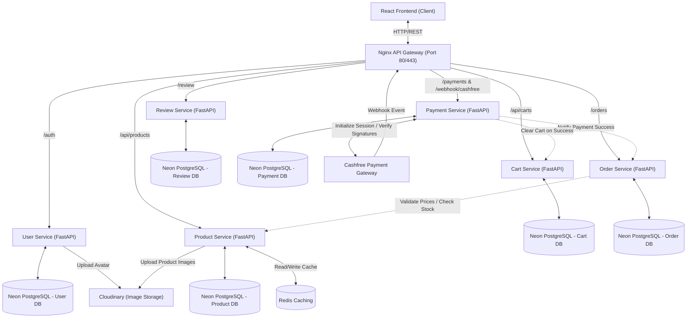

# 🌟 Buyzaar

Buyzaar is a modern, high-performance, and highly scalable **distributed microservices e-commerce platform**. The project is designed with a **database-per-service** model, utilizing an **Nginx API Gateway** as a single entry point for routing, **Redis** for performant caching, and **Neon Serverless PostgreSQL** for database persistence. The client-side is a feature-rich Single Page Application (SPA) built using React, Vite, and styled with Tailwind CSS and Shadcn UI.

---

## 🏗️ System Design & Architecture

Buyzaar implements a modern microservices architecture designed to decouple domain boundaries and scale services independently.



### Architectural Key Concepts
1. **API Gateway Pattern**: An [Nginx Gateway] routes client traffic to respective services based on path rules, providing a single IP access point, SSL/TLS offloading, and security header administration.
2. **Database-Per-Service**: To prevent tight coupling, each microservice has its own isolated schema and PostgreSQL database hosted on **Neon Serverless Postgres**.
3. **Caching Layer**: A [Redis] cache speeds up catalog operations, keeping product records high-performing and reducing direct database load.
4. **Decoupled Integrations**: Image processing (Cloudinary) and Payment settlement (Cashfree) are completely decoupled into asynchronous microservice sub-components.

---

## 🛠️ Technology Stack

Buyzaar leverages a curated technology stack chosen for responsiveness, development speed, and cloud-native scaling:

| Layer | Technologies & Frameworks | Description / Role |
|---|---|---|
| **Frontend** | React 19, TypeScript, Vite, React Router v7, Redux Toolkit, TanStack Query | Client application, global states, optimized routing, and component server-caching. |
| **UI Styling** | Tailwind CSS v4, Shadcn UI, Radix UI, Lucide Icons | Premium aesthetic layout, dark-mode toggle, responsive grids, and custom animations. |
| **API Gateway** | Nginx | Reverse proxy, CORS controller, security headers, routing endpoint mapping. |
| **Backend Services** | Python, FastAPI, SQLAlchemy, Alembic, Uvicorn | Asynchronous endpoint development, migrations, and automatic OpenAPI schema generation. |
| **Data Storage** | Neon Serverless PostgreSQL | Relational transactional storage optimized for cloud scale. |
| **Caching & Session** | Redis | Key-value store for product listings caching and query speedups. |
| **Image Hosting** | Cloudinary | Asset distribution, profile avatars, and product catalog image processing. |
| **Payments** | Cashfree Sandbox SDK | E-Commerce payment session generation, webhook handling, and cryptographic verification. |
| **Orchestration** | Docker, Docker Compose | Service containerization and local infrastructure replication. |

---

## ⚡ Features

### 🛒 Client & Storefront Features
* **Dynamic Catalog & Search**: Advanced product browsing, filtering by categories, and real-time availability checking.
* **Smart Shopping Cart**: Seamless cart additions, quantity modification checks, total item count computation, and stock boundary checks.
* **Seamless Checkout & Payment**: Integrated with **Cashfree Payment Gateway** supporting sandbox credit cards, UPI simulator, and instant transactions.
* **Detailed Ratings & Reviews**: User feedback with visual star ratings, average score calculation, and review history per product.
* **Responsive Fluid Design**: Fully responsive layout matching desktop, tablet, and mobile breakpoints using Tailwind CSS v4.
* **Dynamic Theme Toggle**: System-wide dark/light mode transition with automatic theme persistence.

### 🛡️ User & Admin Management
* **JWT-based Security**: Secure login/signup authentication using JSON Web Tokens (JWT).
* **Cloudinary Uploads**: Profile avatar configurations and admin product images are stored directly in Cloudinary.
* **Admin Dashboard**: Comprehensive operations console including:
  * **Product Management**: Add, update, catalog, or delete products.
  * **Order Tracking**: Comprehensive view of created orders and their payment states.
  * **User Management**: Inspection of registered user accounts and details.

---


## 📁 Project Directory Structure

```
ecommerce-microservices/
├── docker-compose.yml              # Orchestrates local container environments
├── README.md                       # Main project documentation (this file)
├── certs/                          # SSL Certificate configurations for Gateway HTTPS
├── client/                         # Vite + React + TypeScript Frontend
│   ├── Dockerfile                  # Container instructions for client development server
│   ├── package.json                # Frontend dependencies & packages
│   ├── src/                        # Component assets, page routers, and Redux code
│   └── tailwind.config.js          # Styling configurations
└── server/                         # Backend Services and Proxy
    ├── .env                        # Microservice configuration secrets
    ├── gateway/                    
    │   └── nginx.conf              # API Gateway upstream routes
    ├── shared/                     # Shared Python utilities across services
    │   ├── cloudinary.py           # Cloudinary asset uploader
    │   ├── dependencies.py         # JWT and session authentication helper
    │   └── security.py             # Password hashing wrappers
    └── services/                   # Microservice folder boundaries
        ├── user-service/           # User administration & auth endpoints
        ├── product-service/        # Inventory and Redis cache catalog operations
        ├── review-service/         # User feedbacks and reviews DB
        ├── cart-service/           # Active cart memory maps
        ├── order-service/          # Pricing validation, order creation logic
        ├── payment-service/        # Cashfree sessions, signature check, webhooks
        └── recommendation-service/ # Recommendation API (scaffold)
```

---

## 🚀 Getting Started

### Prerequisites
Make sure you have the following installed locally:
* **Docker & Docker Compose** (highly recommended for microservice orchestration)
* **Node.js 18+** (for local frontend development)
* **Python 3.8+** (for manual service execution)

### 🐋 Option 1: Running with Docker Compose (Recommended)

To boot up the entire microservices stack (API Gateway, Redis, services, and frontend client) in a single command, run this from the project root directory:

```bash
docker-compose up -d --build
```

#### Accessing the Platform
* **Frontend Storefront**: [http://localhost:5173](http://localhost:5173)
* **Nginx API Gateway**: [http://localhost](http://localhost) (Proxies backend calls)
* **API Documentation**:
  * User Auth API Docs: `http://localhost/auth/docs`
  * Order API Docs: `http://localhost/orders/docs`

---

### 💻 Option 2: Running Services Locally (For Development)

If you are modifying individual services, you can run them outside of containers.

#### 1. Setup the Backend Environment
Create a `.env` file inside the [server/](file:///c:/Users/sk335/OneDrive/Documents/Coding/WebDev/major_projects/ecommerce-microservices/server) folder matching the structure of Neon DB instances, Cloudinary, and Cashfree credentials.

#### 2. Run a Microservice (Example: User Service)
```bash
# Create and activate virtual environment
python -m venv .venv
source .venv/bin/activate  # On Windows: .venv\Scripts\activate

# Install requirements
pip install -r server/services/user-service/requirements.txt

# Run server with hot-reload
cd server/services/user-service
uvicorn app.main:app --host 0.0.0.0 --port 8000 --reload
```

#### 3. Run the Frontend Client
```bash
cd client
npm install
npm run dev
```

---

## 🔧 API Gateway Routing Configuration

All requests flowing through the API Gateway are mapped in [nginx.conf](file:///c:/Users/sk335/OneDrive/Documents/Coding/WebDev/major_projects/ecommerce-microservices/server/gateway/nginx.conf) to backend upstream targets:

* `/auth` ➔ Proxies to `user-service:8000/auth` (User administration & Login)
* `/api/products` ➔ Proxies to `product-service:8000/api/products` (Catalog operations)
* `/api/carts` ➔ Proxies to `cart-service:8000/api/carts` (Shopping Cart status)
* `/review` ➔ Proxies to `review-service:8000/review` (Product rating feedback)
* `/orders` ➔ Proxies to `order-service:8000/orders` (Order tracking & checks)
* `/payments` ➔ Proxies to `payment-service:5000/payments` (Cashfree payment initialization)
* `/webhook/cashfree` ➔ Proxies to `payment-service:5000/webhook/cashfree` (Event listener)
